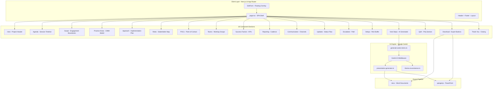

<h1 align="center">CMMI Navigator</h1>

<p align="center">
  <strong>AI-powered CMMI implementation kickoff generator</strong>
</p>

<p align="center">
  <a href="#overview">Overview</a> &middot;
  <a href="#how-it-works">How It Works</a> &middot;
  <a href="#architecture">Architecture</a> &middot;
  <a href="#screenshots">Screenshots</a> &middot;
  <a href="#ai-flows">AI Flows</a> &middot;
  <a href="#tech-stack">Tech Stack</a> &middot;
  <a href="#quick-start">Quick Start</a>
</p>

<br/>

---

## Overview

CMMI Navigator transforms how consulting firms and internal process groups initiate CMMI (Capability Maturity Model Integration) implementation projects. Instead of manually crafting kickoff decks, drafting action plans, and formatting deliverables across multiple tools, this platform generates a complete, production-ready kickoff website from a single form submission.

The output is not just a static page. The same data model powers real-time DOCX and PPTX exports, AI-generated action items, and a fully interactive presentation layer that adapts to every project variable.

**The problem it solves:** A standard CMMI kickoff requires 6-12 hours of manual work — writing the agenda, defining scope, allocating roles, estimating timelines, drafting communication plans, and assembling slides. This app collapses that process into a 15-minute form fill with AI-assisted content generation.

<br/>

### How It Works

```
User fills editable form -> Data updates in real time across 18 sections
  -> AI generates action items per phase
  -> Export to DOCX or PPTX with one click
```

The data model (`CMMIData`) centralizes every project parameter — company name, maturity level, man-day estimates, team structure, scope, timeline, and more. All 18 UI sections read from this single source of truth, so any form update propagates instantly to the hero, agenda, approach, roles, timeline, and download sections simultaneously.

<br/>

## Architecture



### Component Data Flow

All sections are pure render components that receive typed props from the parent `CMMIData` state object. The edit form (`edit-form.tsx`) wraps this object with React Hook Form + Zod validation, and on submit, updates the parent state. This triggers a React re-render across all subscribed sections — no API calls needed for real-time preview.

```
EditForm (Zod validation) -> setData(newData) -> React re-render -> All 18 sections update
```

<br/>

## AI Flows

The Genkit integration provides three specialized AI pipelines:

| Flow | File | Purpose | Trigger |
|:-----|:-----|:--------|:--------|
| **Action Item Generator** | `generate-action-items.ts` | Produces phase-specific, context-aware tasks based on project scope and maturity level | "Generate Next Steps" button |
| **Presentation Generator** | `presentation-generator.ts` | Formats CMMI data into structured slide content for PPTX export | Export to PowerPoint |
| **Theme AI Assistance** | `theme-ai-assistance.ts` | Evaluates user theme inputs and provides feedback based on aesthetic harmony | Theme customization |

Each flow uses Google's Gemini model through the Genkit SDK, with typed input/output schemas for type-safe AI orchestration.

<br/>

## Screenshots

Seven exported PowerPoint slides generated by the platform's PPTX export pipeline:

<p align="center">
  <table>
    <tr>
      <td width="33%" valign="top" align="center">
        <strong>Slide 1</strong><br/>
        <em>Title & Engagement Overview</em>
        <br/><br/>
        
      </td>
      <td width="33%" valign="top" align="center">
        <strong>Slide 2</strong><br/>
        <em>Agenda & Timeline</em>
        <br/><br/>
        
      </td>
      <td width="33%" valign="top" align="center">
        <strong>Slide 3</strong><br/>
        <em>Scope & Practice Areas</em>
        <br/><br/>
        
      </td>
    </tr>
    <tr>
      <td width="33%" valign="top" align="center">
        <strong>Slide 4</strong><br/>
        <em>Approach & Methodology</em>
        <br/><br/>
        
      </td>
      <td width="33%" valign="top" align="center">
        <strong>Slide 5</strong><br/>
        <em>Roles & Responsibilities</em>
        <br/><br/>
        
      </td>
      <td width="33%" valign="top" align="center">
        <strong>Slide 6</strong><br/>
        <em>Teams & Communication</em>
        <br/><br/>
        
      </td>
    </tr>
    <tr>
      <td colspan="3" align="center">
        <strong>Slide 7</strong><br/>
        <em>Next Steps & Action Items</em>
        <br/><br/>
        
      </td>
    </tr>
  </table>
</p>

These slides represent the **generated output** of the Presentation Generator AI flow, demonstrating the platform's ability to produce client-ready deliverables from structured form data.

<br/>

## Core Features

### Dynamic Form with Real-Time Preview

The floating `EditForm` component (activated by a pencil icon) provides multi-tab form access to all project parameters. Data is validated client-side via Zod schemas before updating the unified `CMMIData` state. Every field change propagates instantly across all 18 sections — the hero title, agenda dates, timeline bars, and export documents all update simultaneously.

**Why this matters for consulting:** Kickoff meetings are iterative. Clients change scope mid-session. This lets consultants adjust parameters live and see the full impact across every deliverable in real time.

### 18-Section Component Library

The presentation layer is composed of independently renderable section components, each typed to receive specific slices of the `CMMIData` interface:

| Section | Data Dependency | Visual Format |
|:--------|:---------------|:--------------|
| Hero | Project name, company, maturity level | Title card with metadata |
| Agenda | Date, duration | Chronological timeline |
| Scope | Engagement boundaries, exclusions | Scope matrix |
| Practice Areas | CMMI model selection | Dynamic card grid |
| Approach | Phases, activities, man-days | Gantt-style breakdown |
| Roles | Stakeholder list | Contact cards |
| Teams | Working group assignments | Team roster |
| Reporting | Cadence, audience | Schedule table |
| Next Steps | AI-generated action items | Task list with AI toggle |
| Download | Full data model | DOCX + PPTX export buttons |

### AI-Powered Action Item Generation

The `generate-action-items.ts` Genkit flow takes the current project state and produces context-aware action items for each CMMI implementation phase. The AI considers:
- Maturity level (ML2, ML3, etc.)
- Scope boundaries
- Practice area coverage
- Team structure

The output is a structured list of tasks with ownership and timeline estimates — not generic suggestions but specifically relevant actions based on the project's unique parameters.

### Multi-Format Export Pipeline

The export layer uses two dedicated libraries:
- **docx** — Generates a professionally formatted Microsoft Word document with headers, tables, and structured content
- **pptxgenjs** — Produces a 7+ slide PowerPoint presentation from the same data model

Both exports are generated client-side — no server infrastructure required beyond the initial page load.

<br/>

## Tech Stack

| Category | Technology | Purpose |
|:---------|:-----------|:--------|
| **Framework** | Next.js 14 (App Router) | React meta-framework with file-system routing |
| **Language** | TypeScript | End-to-end type safety |
| **AI Platform** | Google Genkit | Type-safe AI flow orchestration with Gemini |
| **Styling** | Tailwind CSS | Utility-first responsive design |
| **UI Components** | ShadCN UI | Accessible, customizable component primitives |
| **Icons** | Lucide React | Consistent icon system |
| **Form** | React Hook Form + Zod | Performant form state + schema validation |
| **Documents** | docx | Microsoft Word generation |
| **Presentations** | pptxgenjs | PowerPoint slide generation |

<br/>

## Project Structure

```
src/
  app/
    globals.css           Tailwind entry point
    layout.tsx            Root layout with metadata
    page.tsx              Main SPA - orchestrates 18 sections

  ai/
    genkit.ts             Genkit SDK configuration
    dev.ts                Development tooling
    flows/
      generate-action-items.ts   AI task generation
      presentation-generator.ts  Slide content generation
      theme-ai-assistance.ts     Theme evaluation

  components/
    edit-form.tsx          Floating form overlay
    layout/
      header.tsx           Navigation header with scroll links
      footer.tsx           Page footer
    sections/
      hero.tsx             Title card
      agenda.tsx           Timeline
      scope.tsx            Engagement boundaries
      practice-areas.tsx   CMMI model grid
      approach.tsx         Implementation plan
      roles.tsx            Stakeholder map
      pocs.tsx             Point of contact cards
      teams.tsx            Working groups
      success-factors.tsx  KPIs
      reporting.tsx        Report schedule
      communication.tsx    Channel plan
      updates.tsx          Status flow
      escalation.tsx       Escalation path
      delays.tsx           Risk buffer
      next-steps.tsx       AI-generated tasks
      qa.tsx               FAQ
      download.tsx         Export buttons (DOCX + PPTX)
      thank-you.tsx        Closing section
    ui/                   ShadCN UI primitives

  hooks/                   Custom React hooks
  lib/
    data.ts               Default CMMIData + generation logic
    docx-export.ts        Word document generation
    pptx-export.ts        PowerPoint generation

  types/
    index.ts              CMMIData interface + type definitions

docs/
  PPT1.png through PPT7.png     Sample export slides
```

<br/>

## Quick Start

### Prerequisites

- Node.js 18+
- A Google AI API key (Gemini)

### Setup

```bash
# 1. Clone
git clone https://github.com/Aicodebyprince/pptautomation.git
cd pptaautomation

# 2. Install
npm install

# 3. Set environment
echo "GEMINI_API_KEY=your_key_here" > .env

# 4. Start development server
npm run dev
```

Open `http://localhost:9002` in your browser.

### Usage

1. Click the **pencil icon** (floating bottom-right) to open the EditForm
2. Fill in project details across the form tabs
3. Click **Update Website** to apply changes to all 18 sections
4. In the **Next Steps** section, use the AI generator to create action items
5. Use the **Download** section to export DOCX or PPTX files

<br/>

## Roadmap

- Multi-language slide generation
- Custom branding/theme persistence
- Team collaboration with shared state
- Direct PowerPoint export with template selection
- CMMI Level 4 and 5 assessment support
- PDF export for print-ready deliverables

<br/>

---

<p align="center">
  <strong>Built by <a href="https://github.com/Aicodebyprince">Prince Sherathiya</a></strong>
</p>

<p align="center">
  <code>Next.js</code> + <code>Genkit</code> + <code>Tailwind</code> + <code>ShadCN</code>
</p>

<p align="center">
  <em>
    CMMI implementation consulting &middot; AI-assisted process automation &middot;
    <a href="https://github.com/Aicodebyprince">GitHub</a>
  </em>
</p>

<p align="center">
  <small>MIT License &middot; 2026</small>
</p>
